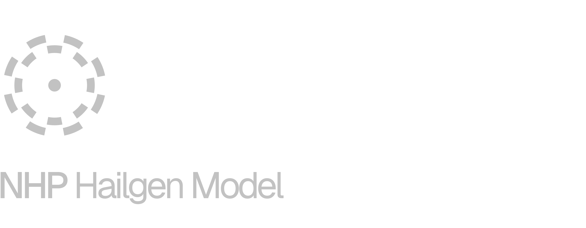
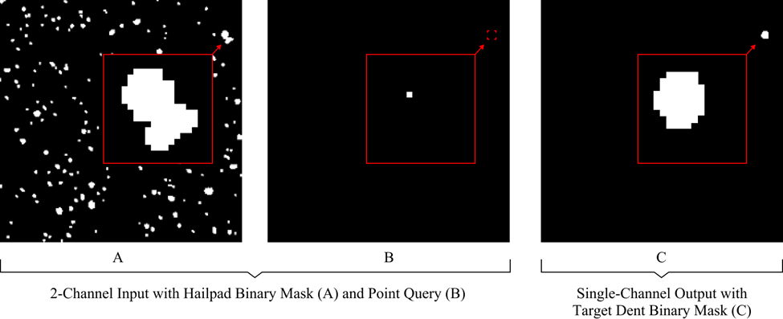

A machine learning model for segmenting individual hail dents from hailpad binary masks. The model uses a point-based query approach with a U-Net architecture to isolate and segment individual dents (instance segmentation), notably in areas with overlapping or clustered impacts.

## Project Structure
```
├── requirements.txt
├── dent-segmentation-model/
│   ├── best_model.weights.h5   # Model weights
│   ├── dataset.py              # Dataset handling
│   ├── model.py                # Model architecture
│   ├── validate.py             # Model validation
│   └── generator/
│       ├── config.json         # Generator configuration
│       ├── generate.py         # Synthetic hailpad generator
│       └── output/             # Generated training data
```

#### [Model weights can be accessed here](https://uwoca-my.sharepoint.com/:u:/g/personal/kmanka_uwo_ca/EaKllTmGSHpJvbFitD7O3jwBaMP78eA369I-UVBVng2p6w?e=AIcHOf)

## Training and Validation Datasets



### Data Generator

The training data generator creates synthetic hailpad binary masks with simulated dent shapes. Each dent is created using Perlin noise to generate irregular dent-like shapes from base ellipses.

### Configuration
Configure generation parameters in `dent-segmentation-model/generator/config.json`:

- `diameter_range`: Min./max. dent diameters
- `axis_variation`: Variation in dent ellipse axes
- `dent_count`: Maximum number of dents per hailpad
- `exp`: Use exponential size distribution
- `hailpad_count`: Number of hailpads to generate
- `num_points`: Point queries per dent
- `directory`: Output directory path

### Hailpad Categories

(1a)&nbsp;&nbsp;&nbsp;&nbsp;Uniformly-distributed small dents with low density\
(1b)&nbsp;&nbsp;&nbsp;&nbsp;Uniformly-distributed large dents with low density\
(2)&nbsp;&nbsp;&nbsp;&nbsp;&nbsp;&nbsp;Uniformly-distributed dents with high density\
(3)&nbsp;&nbsp;&nbsp;&nbsp;&nbsp;&nbsp;Exponentially-distributed dents\
(4)&nbsp;&nbsp;&nbsp;&nbsp;&nbsp;&nbsp;Exponentially-distributed dents with high density